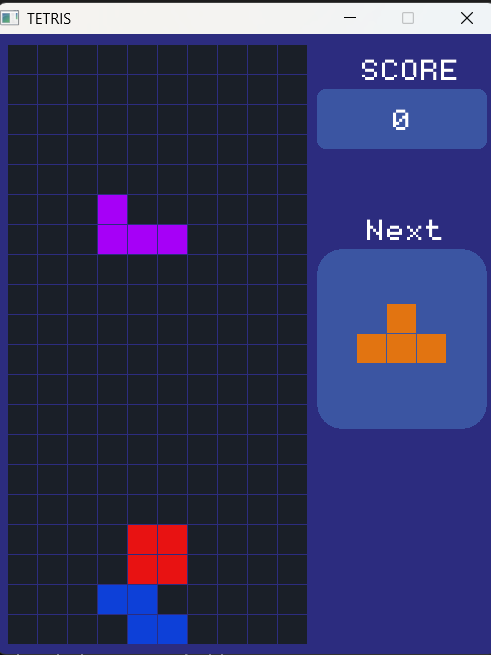

# 🎮 Tetris in C

> "The journey of a thousand miles begins with a single step" - Lao Tzu

A classic Tetris game built from scratch in C using the raylib library.



## 🕹️ Controls

| Key | Action |
|-----|--------|
| ← → or A D | Move left / right |
| ↑ or W | Rotate piece |
| ↓ or S | Soft drop |
| R | Restart after game over |

## 🎯 Scoring

| Lines Cleared | Points |
|---------------|--------|
| 1 line | 100 |
| 2 lines | 200 |
| 3 lines | 300 |
| 4 lines | 400 |


## 🛠️ Build from Source

**Requirements:**
- GCC
- raylib

**Compile:**
```bash
gcc *.c -o tetris.exe -I../raylib/include -L../raylib/lib -lraylib -lopengl32 -lgdi32 -lwinmm -static
```

## 📁 Project Structure
```
src/
├── main.c
├── grid.h / grid.c
├── block.h / block.c
├── tiles.h / tiles.c
├── color.h / color.c
└── common.h
assets/
├── music.mp3
├── clear.mp3
├── rotate.mp3
├── gameover.mp3
└── monogram.ttf
```

## 👤 Author

**Zahin Bin Hasan**

## ⬇️ How to Download & Play

1. Go to [Releases](https://github.com/zahin-beta/Tetris-in-c/releases/tag/v1.0)
2. Download `tetris.zip`
3. Extract the zip
4. Run `tetris.exe`

> Windows only. No installation required.


## 🙏 Credits
This project was inspired by [this tutorial](https://www.youtube.com/watch?v=wVYKG_ch4yM&t=3036s).
